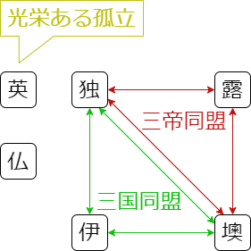
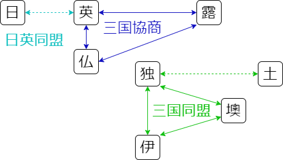

# 帝国主義④ 列強の国際関係の変化

## <復習>

ビスマルク期の国際関係  
... 独が墺・露・伊と協調し、仏を孤立させて戦争を抑制  
   

## ヴィルヘルム期のドイツ

- 独の新皇帝**ヴィルヘルム2世**は**ビスマルク**と対立  
  → 1890年に**ビスマルク**を解任し、独露間の**再保障条約**更新を見送る  
  → 仏が露に接近し、1894年に**露仏同盟**を結成  
  ※再保障条約とは独仏間の戦争の際には露が、英露あるいは墺露間の戦争の際には独が中立を守るという相互中立条約。1887年に結ばれた。  

- ヴィルヘルム2世は「**世界政策**」を掲げて挑発的な対外関係を展開  
  ex: 海軍を増強して英と**建艦競争**を展開  

- 独は英領インドを脅かす為、中東への進出を企図  
  → オスマン帝国に接近して**バグダード鉄道**の施設権獲得  
  → **ベルリン**～**ビザンティウム(イスタンブル)**～**バグダード**を結ぶ**3B政策**を構想  

- 中東やバルカン半島をめぐる独英・独露の対立が深刻化  
  → 利害が一致した英露により1907年に**英露協商**が成立  
  → 英仏露の**三国協商**による対独包囲陣が成立  

- 独は墺との関係を強化  
  独墺伊の**三国同盟**で対抗し、オスマンとも連携  
  ただし伊は墺支配下の「**未回収のイタリア**」を求める  

- 大戦直後の国際関係  
     
